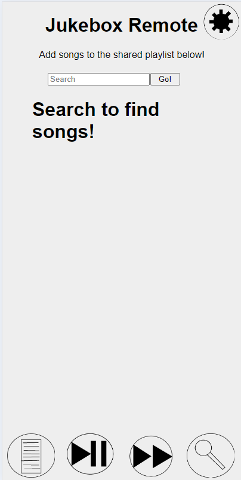

# Party Jukebox
*This project requires VLC to play sound files*

You can use `--help` on any of the python files to see all the properties that can be changed at runtime
## Purpose
The **Party Jukebox** is a program that allows many people to add music, skip songs, play, and pause from any web device to the same device and playlist. \
This was created for a personal use case for parties, and is a simple, (mostly) functional solution to have a collective playlist for local mp3 files. \
The main advantage compared to doing something similar using Spotify is that you can limit the songs that can be played to your selection. Songs can be chosen, but only from a list.
## Basic Setup
### Client Setup:
The client is a web application that can be hosted on any server, it need not be the same device running the music player. 
* If the app is being setup for a large group, you can distribute the url (via QR code, for example) with `?ip=YOURSERVERHOSTNAME:19054` set as an attribute after the url. 
### Server Setup:
**Pre-setup:** If you want the songs to have art associated with them, it is all hosted on and retrieved from LastFM, and you will need to sign up for a developer app, and put your key in the database generator \
\
The server side consists of 3 files:

```
sound/
databaseGenerator.py
webbyBits.py
```

1. Place mp3 files in the `sound/` folder
2. Open `databaseGenerator.py` and put your LastFM API key in at the top or at runtime using `-k APIKey` (*optional*)
3. Run `databaseGenerator.py`
    * *The `databaseGenerator.py` will index all mp3 files, and save the information to `songDatabase.db`*
    * *If getting images, this process may take a long time with a large amount of mp3 files*
4. Run `webbyBits.py`
    * *The port can be customized at runtime using* `-p portNumber` *as an atribute*
    * *You can add an admin password at runtime with* `-a AdminPass` *as an atribute*
        * ***NOTE: Do not reuse ANY password for this, it is 100% unsecure. The best option is just a random string you write down once***

You can now connect with the client and use the app as normal. \
*Make sure you have turned down/off any other apps that might make noise or notification sounds* \
\
Read on for specific information on each piece of the app.
## Details
These are specific details on each section of the app, and how to use them
### Server:
- `sound/` contains all mp3 files by default
- `databaseGenerator.py` scans through mp3 files and gets information about them
    - `Filename, Title, Artist, Art, Length` are all saved 
        - *If the title and artist are not in the mp3 metadata, it looks for a format of* `TITLE_ARTIST.mp3` *then of* `ARTIST - TITLE.mp3` *and otherwise defaults to the file name as the title, and no artist*
        - Art is retrieved from LastFM
    - Running with `--mode (update/new)` either updates the current database and adds new songs/removes deleted songs, or recreates the entire database (update is default, and is faster in art mode)
    - Running with `--art (True/False)` retrieves art from  LastFM or doesn't (True is default)
        - *Can only generate one song / 0.25 seconds, to avoid pinging the LastFM server too much*
    - Running with `--apikey (KEYhere)` sets the LastFM key for that run
        - If this is set to an empty string (Default) the app runs in non-art mode
    - Running with `--directory (directoryOfmp3s)` allows for sound files to be in a different place
        - Default `"./sound/"`
        - _This setting might be kinda iffy on Linux. You're on Linux just go and edit it if you have issues_
        - ~~__Make certain you only use forward slashes in your directory, even on Windows__~~ I think this should be fine now i'll check later
- `songDatabase.db` stores all the information about each song in a SQLite database with tables `songs` and `meta`
- `webbyBits.py` imports the database, runs all music playing, and accepts all commands from clients
    - Searches return matching songs
    - Accepts Play-Pause and Skip commands
    - Uses port 19054 by default
        - `--port (port)` changes the port for that run
        - The default port can be changed in the file
    - Running with `--admin (admin password)` sets an admin password for moderation on the client
        - ***Note: Do not reuse a password, consider this like making whatever this string is public, no security is guaranteed***
        - Anyone who knows the admin password can enter it on the client and change the abilities of any non-admin users (for example to limit skipping)
            - The total set of features that can be restricted is 
                - Skip track 
                - Play-pause toggle
                - Add track 
                - Partymode toggle
                - Change volume
        - When this argument is left out (or empty string) the admin features aren't used, and everyone can do everything

### Client:
 \
From left to right:
- The playlist button shows the current queue of songs
    - The currently playing song is identified, and has the duration listed
- The play-pause button toggles playing
- The skip button goes to the next track
- The search button opens the search screen (pictured)
- The settings button (top right) opens the settings menu
    - Server IP allows you to change the ip that the site connects to
    - Alert time changes how long error/confirmation messages are shown for (Default 2s)
    - Party Mode adds new songs to the queue when the queue has only 1 song in it
    - Volume controls the VLC volume of the connected server
        - *Because the volume can be controlled in the client, for best usage set your device volume as high as possible and turn it down using this slider*
    - QR code to allow others to connect to and use the Remote

*See `LICENSE.md` for redistribution details.