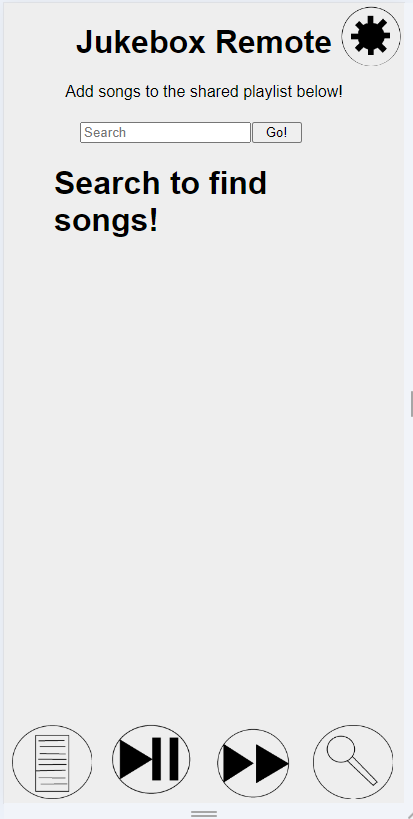

# Party Jukebox
*This project requires VLC to play sound files*
## Purpose
The **Party Jukebox** is a program that allows many people to add music, skip songs, play, and pause from any web device to the same device and playlist. \
This was created for a personal use case for parties, and is a simple, (mostly) functional solution to have a collective playlist for local mp3 files.
## Basic Setup
### Client Setup:
The client is a web application that can be hosted on any server, it need not be the same device running the music player. 
* If the app is being setup for a large group, you can distribute the url (via QR code, for example) with `?ip=YOURSERVERHOSTNAME:19054` set as an attribute after the url. 
### Server Setup:
**Pre-setup:** If you want the songs to have art associated with them, it is all hosted on and retrieved from LastFM, and you will need to sign up for a developer app, and put your key in the database generator \
\
The server side consists of 3 files

```
sound/
databaseGenerator.py
webbyBits.py
```

1. Place mp3 files in the `sound/` folder
2. Open `databaseGenerator.py` and put your LastFM API key in at the top (*optional*)
3. Run `databaseGenerator.py`
    * *The `databaseGenerator.py` will index all mp3 files, and save the information to `songDatabase.json`*
    * *If getting images, this process may take a long time with a large amount of mp3 files*
4. Run `webbyBits.py`

You can now connect with the client and use the app as normal. \
Read on for specific information on each piece of the app.
## Details
These are specific details on each section of the app, and how to use them
### Server:
- `sound/` contains all mp3 files
- `databaseGenerator.py` scans through mp3 files and gets information about them
    - `Filename, Title, Artist, Art, Length` are all saved 
        - *If the title and artist are not in the mp3 metadata, it looks for a format of* `TITLE_ARTIST.mp3` *and otherwise defaults to the file name as the title, and no artist*
        - Art is retrieved from LastFM
    - Running with `--mode (update/new)` either updates the current database and only adds new songs, or recreates the entire database (update is default)
    - Running with `--art (True/False)` retrieves art from  LastFM or doesn't (True is default)
- `songDatabase.json` stores all the information about each song in this format:
```
[
    {
    "file": "The Search_NF.mp3", 
    "title": "The Search", 
    "artist": "NF", 
    "art": "https://lastfm.freetls.fastly.net/i/u/64s/03125956378d531a44e1b7da89aae795.png", 
    "length": 292
    }
]
```
- `webbyBits.py` imports the database, runs all music playing, and accepts all commands from clients
    - Searches return matching songs
    - Accepts Play-Pause and Skip commands

### Client:
 \
From left to right:
- The playlist button shows the current queue of songs
- The play-pause button toggles playing
- The skip button goes to the next track
- The search button opens the search screen (pictured)
- The settings button (top right) opens the settings menu
    - Server IP allows you to change the ip that the site connects to
    - Alert time changes how long error/confirmation messages are shown for (Default 2)
    - Party Mode adds new songs to the queue when the queue has only 1 song in it
    - 


