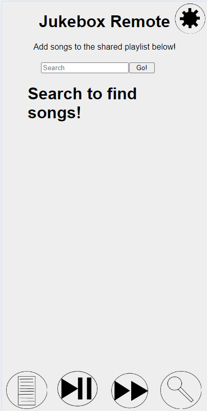

# Party Jukebox
*This project requires VLC to play sound files*

You can use `--help` on any of the python files to see all the properties that can be changed at runtime
## Purpose
The **Party Jukebox** is a program that allows many people to add music, skip songs, play, and pause from any web device to the same device and playlist. \
This was created for a personal use case for parties, and is a simple solution to have a collective playlist for local audio files. \
The main advantage compared to doing something similar using Spotify or another streaming service is that you can limit the songs that can be played to your selection. Songs can be chosen, but only from a list.
## Basic Setup
### Client Setup:
The client is a web application hosted by the flask app running the audio player. 
* You can add `?darkmode=(true/false)` to the client URL to set the default colour scheme, but this will be overwritten by the user's saved choice if they change it themselves
### Server Setup:
**Pre-setup:** If you want the songs to have art associated with them, it is all hosted on and retrieved from LastFM, and you will need to sign up for a developer app, and put your key in the database generator \
\
The server side consists of 3 files and a directory:

```
sound/
databaseGenerator.py
webbyBits.py
.env
```

1. Place audio files in the `sound/` folder
    - Supports flac, mp3, and wav files
2. Rename `example.env` to `.env` and...
    - Set the location where your audio files are (Default: `./sound/`)
    - Set the LastFM API key (Optional)
    - Change the port of the app (Default: `19054` )
3. Run `databaseGenerator.py` (Will try to use LastFM API key)
    * *The `databaseGenerator.py` will index all audio files, and save the information to `songDatabase.db`*
    * *If getting images, this process may take a long time with a large amount of audio files*
4. Run `webbyBits.py`
    * *The port can be customized by editing the `.env` file*
    * *You can add an admin password at runtime with* `-a True` *as an atribute*
        * ***NOTE: Do not reuse ANY password for this, it is hashed but 100% unsecure. The best option is just a random string you write down once***
        * You will be prompted in console for a password to be used
        * If this attribute isn't included a random string will be generated as the admin password
        * This is intended for protecting certain features for small closed events, not for public security

You can now connect with the client and use the app as normal. \
*Make sure you have turned down/off any other apps that might make noise or notification sounds* \
\
Read on for specific information on each piece of the app.
## Details
These are specific details on each section of the app, and how to use them
### Server:
- `sound/` contains all audio files by default
- `databaseGenerator.py` scans through audio files and gets information about them
    - `Filename, Title, Artist, Art, Length` are all saved 
        - *If the title and artist are not in the file metadata, it looks for a format of* `TITLE_ARTIST.mp3` *then of* `ARTIST - TITLE.mp3` *and otherwise defaults to the file name as the title, and no artist*
        - Art is retrieved from LastFM
    - Running with `--mode (update/new)` either updates the current database and adds new songs/removes deleted songs, or recreates the entire database (update is default, and is faster in art mode)
    - Running with `--art (True/False)` retrieves art from  LastFM or doesn't (True is default)
        - *Can only generate one song / 0.25 seconds, to avoid pinging the LastFM server too much*
    - Directory to index for music files can be set in the `.env` file
- `songDatabase.db` stores all the information about each song in a SQLite database with tables `songs` and `meta`
- `webbyBits.py` imports the database, runs all music playing, and accepts all commands from clients
    - Searches return matching songs
    - Accepts Play-Pause and Skip commands
    - Uses port 19054 by default
        - Can be changed in the `.env` file
    - Running with `--admin (admin password)` sets an admin password for moderation on the client
        - ***Note: Do not reuse a password, the password is hashed before being sent over the network, but I still wouldn't bet my house on it, no security is guaranteed***
        - Anyone who knows the admin password can enter it on the client and change the abilities of any non-admin users (for example to limit skipping)
            - The total set of features that can be restricted is 
                - Skip track 
                - Play-pause toggle
                - Add track to queue
                - Partymode toggle
                - Change volume
                - Add duplicate track to queue
                    - This is a seperate toggle, but is based on the setting "Add track to queue"
                    - Basically if you can't add at all, you can't add a duplicate either (obviously)
        - When this argument is left out a random string is generated and printed in console to be the admin password (so keep the console window hidden if you don't want to use it)

### Client:
 \
From left to right:
- The playlist button shows the current queue of songs
    - The currently playing song is identified, and has the duration listed
- The play-pause button toggles playing
- The skip button goes to the next track
    - *No "previous" button is a design decision (It's a feature not a bug)*
- The search button opens the search screen (pictured)
- The settings button (top right) opens the settings menu
    - Dark mode sets a dark mode and stores a cookie to keep you in dark mode after refreshing
    - Server IP allows you to change the ip that the site connects to
    - Alert time changes how long error/confirmation messages are shown for (Default 2s)
    - Party Mode adds new songs to the queue when the queue has only 1 song in it
    - Volume controls the VLC volume of the connected server
        - *Because the volume can be controlled in the client, for best usage set your device volume as high as possible and turn it down using this slider*
    - QR code to allow others to connect to and use the Remote
    - Admin password can be set to restrict actions for general users, or avoid the set restrictions

### A quick note on the password feature

The exact process of the password's plaintext scope is as follows

- On the server, you type in the password on the server in the console, the python script takes that input directly, hashes it, then stores that hash as a variable. The plaintext could be in memory, but it's not accessible in the code after that initial hashing. If you typed your own password, it won't be visible in the console history after it is typed.

- On the client, you type in the password and press enter. A function reads the value of the password box, saves the hash of that password to a variable, and sends it with all your requests. The plaintext is still stored in the input box, but if you delete it and don't press enter on the box again, the hash will be stored without keeping the plaintext. (I may change this behaviour so this box auto-clears when enter is pressed)

None of this is "secure", but it's better than sending plaintext passwords, which is what I was doing before. Hypothetically somebody who intercepted any packets with the password can't get back the original plaintext, just the hash. 

## External Credits
 - QR Code Generator: JS file found [here](https://cdnjs.cloudflare.com/ajax/libs/qrcodejs/1.0.0/qrcode.min.js)
 - Socket.io: JS file found [here](https://cdn.socket.io/4.7.5/socket.io.min.js)
 - SHA256 over http: JS file found [here](https://cdnjs.cloudflare.com/ajax/libs/js-sha256/0.11.0/sha256.min.js)

## AI Transparency

Most of this code is my own. This is a project I started as a final for high school, and is the first large (for me) project I've worked on. I have always used basic chat AI to debug or for ideas about best practices, but now I've started to use agents(? is that what claude code is) to fully create new sections of the app. The first one of these is the loading wheel, in the top left of the GUI. There will be more as I continue to expiriment and use more AI. My plan is to keep this section as a list of the features created with AI. I'm very proud of this project, and I want to be clear about what is mine and what isn't.

### AI Created Features
- Loading Wheel (GUI)

*See `LICENSE.md` for redistribution and editing details.*
